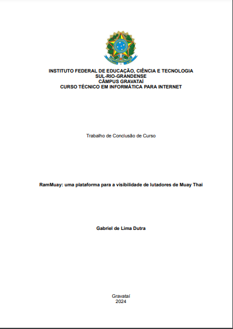
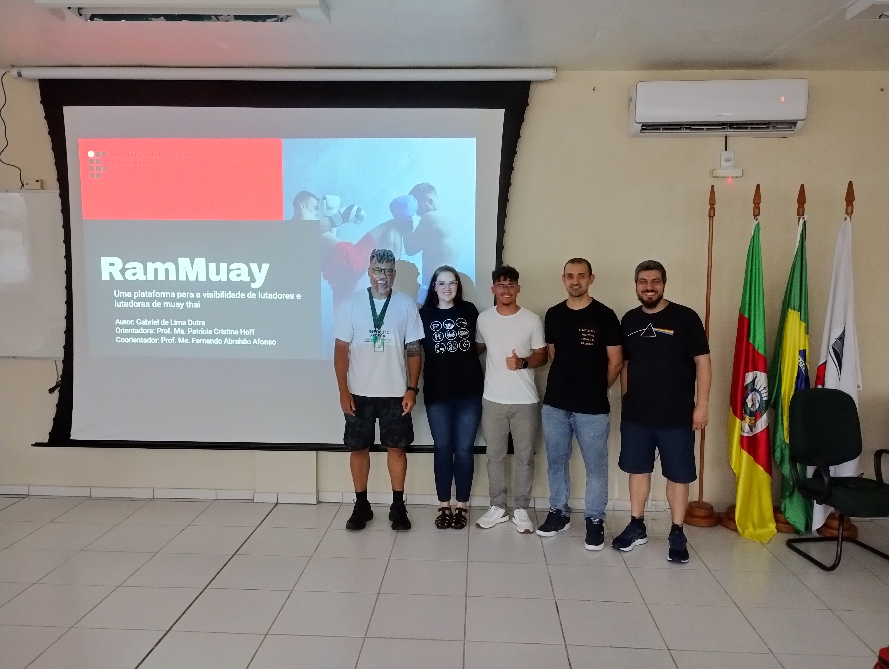
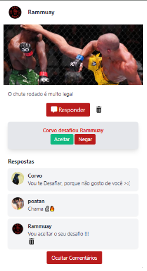
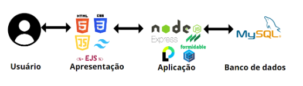
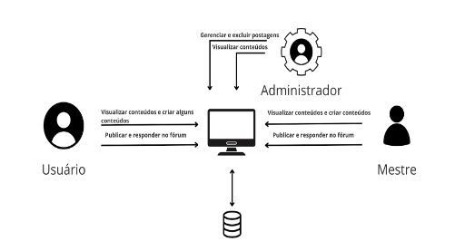
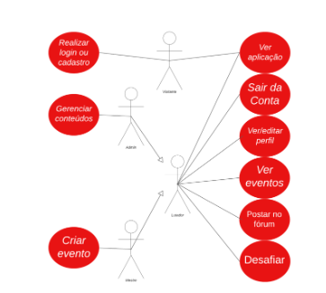

# 🥊 **RamMuay**  

 <!-- Substitua # pelo caminho do banner da sua logo -->

Uma plataforma para a visibilidade de lutadores de Muay Thai.  

---

## 📜 **Justificativa**  
A RamMuay foi idealizada por mim, Gabriel de Lima Dutra, ao perceber um problema enfrentado por muitos lutadores enquanto eu treinava Muay Thai. Entre os desafios relatados, destacam-se:  
- 🚫 **Falta de patrocínio**: Muitos lutadores não possuem uma maneira fácil de divulgar seu trabalho ou atrair patrocinadores.  
- 🏆 **Acesso limitado a eventos**: Lutadores frequentemente são excluídos de eventos por não fazerem parte de academias renomadas.  

Essas dificuldades prejudicam a carreira de atletas talentosos, limitando suas oportunidades de crescimento e reconhecimento no esporte.  

---

## 🎯 **Objetivo**  
A RamMuay tem como objetivo ser uma central de apoio para lutadores de Muay Thai, oferecendo ferramentas que:  
- 🌟 Aumentem a **visibilidade** dos lutadores para patrocinadores, academias e organizadores de eventos.  
- 🗂️ Facilitem o **cadastro e participação em eventos**, democratizando o acesso para atletas de todos os níveis.  
- 💬 Forneçam um espaço de **interação e engajamento** por meio de fóruns e desafios entre lutadores.  

---

## 📝 **Sobre o Projeto**  
Este projeto é o meu Trabalho de Conclusão de Curso (TCC), e me sinto muito feliz em compartilhar esta versão da plataforma que foi submetida e aprovada pela banca.  

 <!-- Substitua # pelo caminho da imagem da capa do TCC -->

Apesar de ter cumprido todas as funcionalidades propostas, acredito firmemente na frase de Paul Leary:  
> “Não existe tal coisa como um programa finalizado; sempre há algo mais a adicionar, corrigir ou melhorar.”  

### 📸 Foto da Banca  
 <!-- Substitua # pelo caminho da imagem da banca -->

Caso queira acessar a parte escrita do meu trabalho, basta clicar [aqui](#) (substituir o link pelo real).  

---

## 🚀 **Funcionalidades Principais**  
 <!-- Substitua # pelo caminho da imagem demonstrativa das funcionalidades -->

- 📋 Fórum para discussões sobre Muay Thai.  
- 🎴 Sistema de desafios entre lutadores.  
- 📆 Cadastro e gerenciamento de eventos.  
- 🔒 Autenticação e gerenciamento de usuários.  

---

## 🏗️ **Arquitetura da Aplicação**  
A plataforma **RamMuay** foi desenvolvida utilizando tecnologias modernas e eficazes, garantindo uma aplicação robusta e funcional. Abaixo estão as principais tecnologias empregadas na sua construção:

 <!-- Substitua # pelo caminho da imagem da arquitetura -->

### **📜 Front-end**  
1. **HTML (HyperText Markup Language)**:  
   Utilizado para estruturar as telas que os usuários visualizam, permitindo a publicação de conteúdos como texto, imagens, vídeos e áudios na web.  

2. **CSS (Cascading Style Sheets)**:  
   Aplicado para estilizar os elementos HTML, aprimorando a interface visual da plataforma. Além disso, foi utilizado o framework **Tailwind CSS**, que permite uma estilização rápida e eficiente por meio de classes pré-definidas.  

3. **EJS (Embedded JavaScript Templates)**:  
   Uma linguagem de template simples que possibilita a criação de páginas dinâmicas, gerando marcação HTML com JavaScript.  

### **🔧 Back-end**  
1. **JavaScript**:  
   Linguagem principal utilizada no desenvolvimento da aplicação, adicionando interatividade às funcionalidades.  

2. **Node.js**:  
   Um ambiente de execução JavaScript assíncrono orientado a eventos, projetado para construir aplicações escaláveis. Foi utilizado para estruturar toda a lógica da aplicação.  

3. **Express.js**:  
   Framework que simplifica a criação e o gerenciamento de rotas no back-end, permitindo a construção de código mais organizado e eficiente.  

4. **Passport**:  
   Middleware de autenticação flexível e modular para validação de usuários cadastrados, garantindo segurança nos processos de login.  

5. **Nodemailer**:  
   Ferramenta usada para envio de e-mails, responsável por validar lutadores mestres na plataforma.  

6. **Formidable**:  
   Um módulo para análise de dados de formulário, especialmente útil para uploads de arquivos, como imagens de eventos ou perfis.  

### **🗄️ Banco de Dados**  
1. **MySQL**:  
   Banco de dados relacional utilizado para armazenar as informações da plataforma, incluindo dados de usuários, eventos, desafios e postagens no fórum.  

2. **Sequelize**:  
   ORM (Object-Relational Mapping) moderno que facilita a interação com o banco de dados MySQL, proporcionando uma manipulação de dados mais eficiente e organizada.  

---

## 📊 **Modelo da Aplicação**  
Abaixo está uma ilustração que demonstra o funcionamento do modelo da aplicação:  
 <!-- Substitua # pelo caminho da imagem da arquitetura -->

O modelo considera três tipos principais de usuários:  
1. **Lutador (Usuário Comum):**  
   - Pode cadastrar-se, realizar login e atualizar suas informações pessoais.  
   - Possui acesso limitado às funcionalidades da plataforma.  
   - Pode criar e responder publicações no fórum, visualizar eventos e desafiar outros lutadores.  
2. **Mestre:**  
   - Possui todas as permissões do lutador.  
   - Pode criar eventos de luta, que ficam visíveis para todos os usuários da plataforma.  
3. **Administrador:**  
   - Pode visualizar todos os conteúdos postados.  
   - Possui permissão para apagar qualquer conteúdo na plataforma.  

---

## 📜 **Casos de Uso**  
Os casos de uso principais da plataforma são ilustrados na imagem abaixo:  
 <!-- Substitua # pelo caminho da imagem dos casos de uso -->

1. **Lutador:**  
   - Visualizar eventos.  
   - Participar do fórum criando tópicos e respondendo publicações.  
   - Desafiar outros lutadores e gerenciar seus desafios.  
2. **Mestre:**  
   - Criar eventos.  
   - Gerenciar interações no fórum e desafios.  
3. **Administrador:**  
   - Monitorar e gerenciar todos os conteúdos da plataforma.  

---

## 📐 **Diagrama ER**  
Abaixo está o diagrama de Entidade-Relacionamento (ER) que ilustra o banco de dados utilizado pela plataforma:  
 <!-- Substitua # pelo caminho do diagrama ER -->

As tabelas principais incluem:  
- **Tb_Evento:** Armazena dados de eventos, como nome, descrição, preço de ingresso e local.  
- **Tb_Usuario:** Gerencia os usuários da plataforma, com informações como nome, e-mail e tipo de usuário (Lutador, Mestre ou Administrador).  
- **Tb_Postagem:** Contém as postagens feitas no fórum, incluindo descrições e imagens.  
- **Tb_Topico:** Representa os tópicos criados no fórum, vinculados às postagens.  
- **Tb_Categoria:** Organiza os lutadores por categoria de peso.  
- **Tb_Comentario:** Gerencia os comentários feitos nas postagens.  
- **Tb_Desafio:** Contém informações sobre desafios entre lutadores.  

---

## 🛠️ **Tecnologias Utilizadas**  
- **Back-end**: Node.js, Express, Sequelize (ORM).  
- **Banco de Dados**: MySQL.  
- **Front-end**: EJS e Tailwind CSS.  

---

## 🥋 **Sobre o Nome "RamMuay"**  
O nome da plataforma é inspirado na tradicional dança ritual Ram Muay, realizada pelos lutadores de Muay Thai antes das lutas. Ele reflete a essência e a cultura do esporte.  

---

## 🤝 **Contribuições**  
Sinta-se à vontade para sugerir melhorias, relatar problemas ou contribuir com novas funcionalidades.  

**Se Depender de Nós Vamos Até o Fim** 🥊🔥  
